# Harry Potter Potions | Web page

## Índice

* [1. Resumen del proyecto](#1-resumen-del-proyecto)
* [2. Investigacion de usuario](#2-investigacion-de-usuario)
* [3. Historias de usuario](#3-historias-de-usuario)
* [4. Autoras](#4-autoras)

***

## 1. Resumen del proyecto

En este proyecto se diseño y contruyo una **_pagina web_** con el objetivo de poder visualizar, filtrar, ordenar y ver porcentajes de coincidencia de acuerdo a las posiones que maneja la saga de **_Harry Potter_**.

* **Pantalla inicial**.
  Este pantalla proporciona al usuario la posibilidad de acceder a diferentes acciones.

* **Pantalla de visualizacion**.
  Este pantalla proporciona la lista de las diferentes posiones que existen en la saga de peliculas de Harry Poter, esta lista esta conformada por el nombre de la posion y su respectiva descripcion.

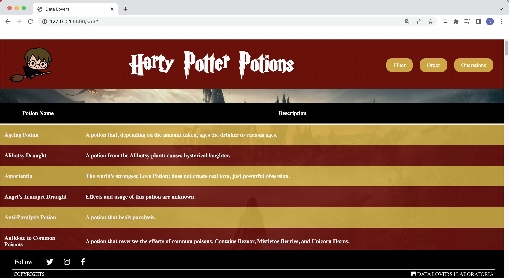

* **Pantalla de filtrado**.
  Este pantalla brinda la posibilidad de filtrar por nombre o descripcion dada una palabra de busqueda que ingresa la usuaria.

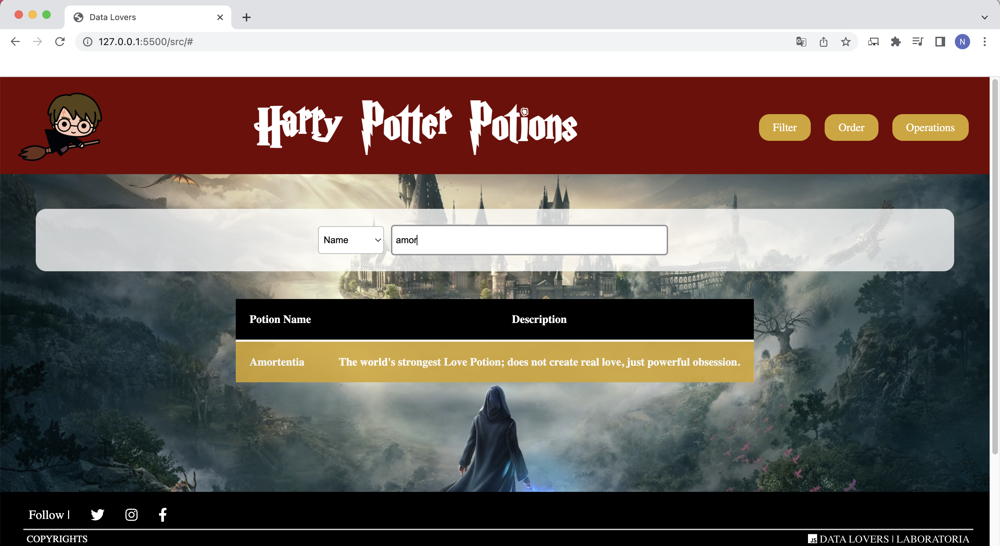

* **Pantalla de ordenado**.
  Este pantalla brinda la posibilidad de ordenar de A-Z y de Z-A por el nombre de las posiones.

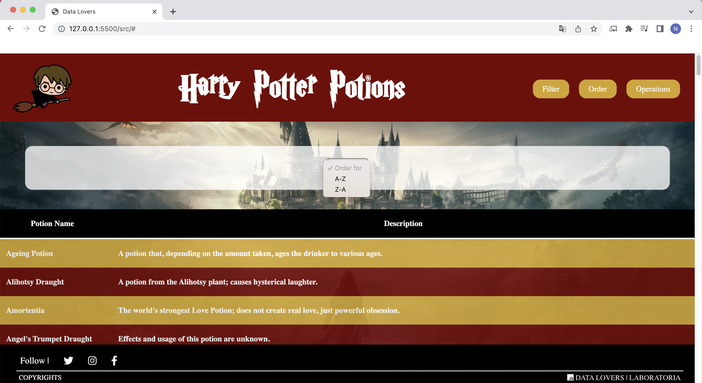
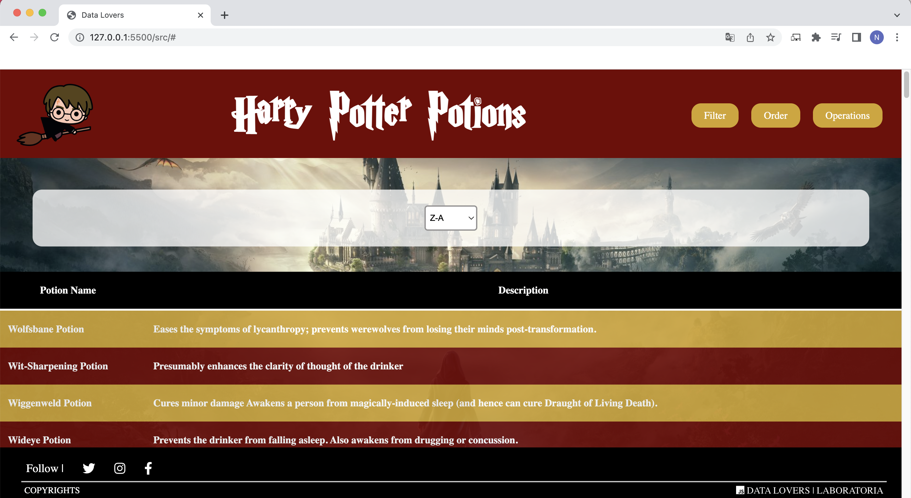

* **Pantalla de operaciones**.
  Este pantalla brinda la posibilidad a la usuaria el porcentaje de coincidencias y cantidad de posiones resultantes de una palabra ingresada por esta misma.

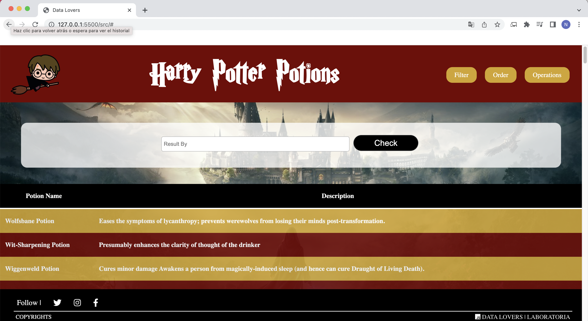

## 2. Investigacion de usuario.

Para este proyecto se realizo la investigacion de usuario con cinco (5) personas, las cuales fueron testeadas por Whatsapp y presencial. Este testeo arrojo la siguiente informacion:

###**Primera Pregunta:**

1.	¿Cuál de las siguientes temáticas de Harry Potter te gusta más?
a)	Información sobre los personajes: nombre, especie, género, fecha de nacimiento, saber si es muggle o conocer su casa de estudio.
b)	Sistema de casas ( Gryffindor, Hufflepuff, Ravenclaw y Slytherin: cuantos estudiantes hay por cada casa, fundador, elemento, colores de la casa, animal, rasgos.
c)	Hechizos: conocerlos, invocarlos y estar preparados para ellos.
d)	Libros: cuantos libros han sido publicados y visualizar que personajes aparecen en cada libro, año de publicación, copias vendidas, paginas, editorial.
e)	Pociones: Lista de las pociones que existen, para que se usan, cuáles son sus ingredientes, efectos secundarios y si es mortal o no.

 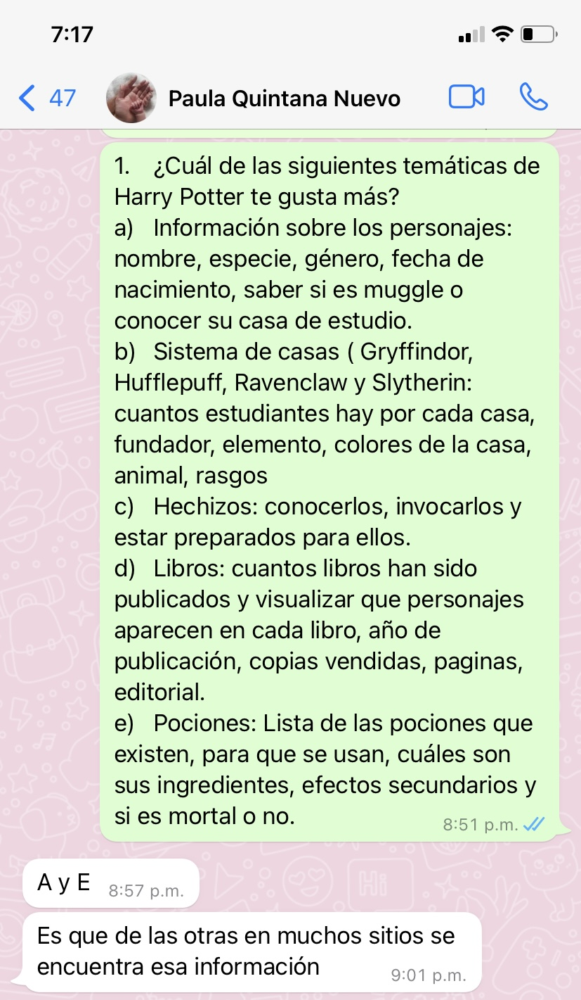

 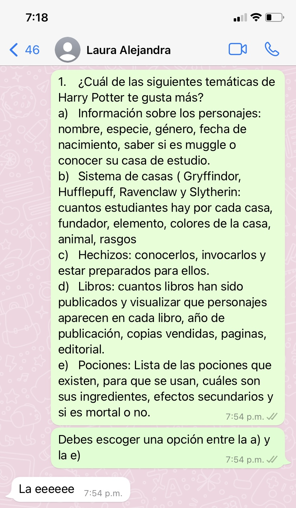

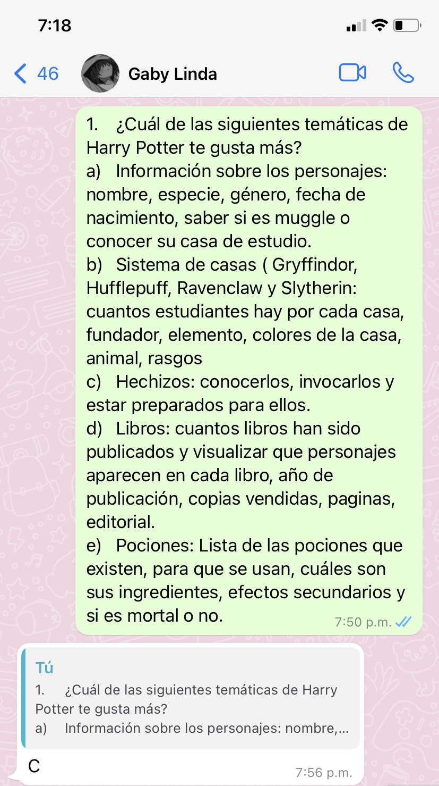

**_Respuestas adicionales:_**
  * Usuario 4: Selecciona la opcion e
  * Usuario 5: Selecciona la opcion e

**Dadas estas respuestas, se procede a escoger el tema de "Posiones"**

###**Seleccion del estilo**

Para el desarrollo de la pagina web se diseño en **_Figma_** dos diferentes estilos de pagina y se pregunto al usuario cual era el diseño mas atractivo visualmente, si era intuitiva y si reconocian su funcionamiento facilmente, a continuacion la respuestas:

 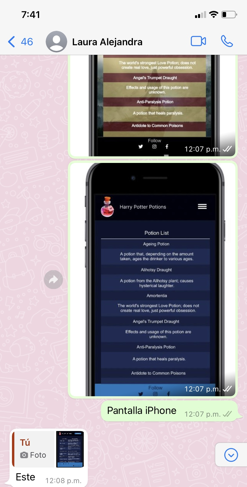

 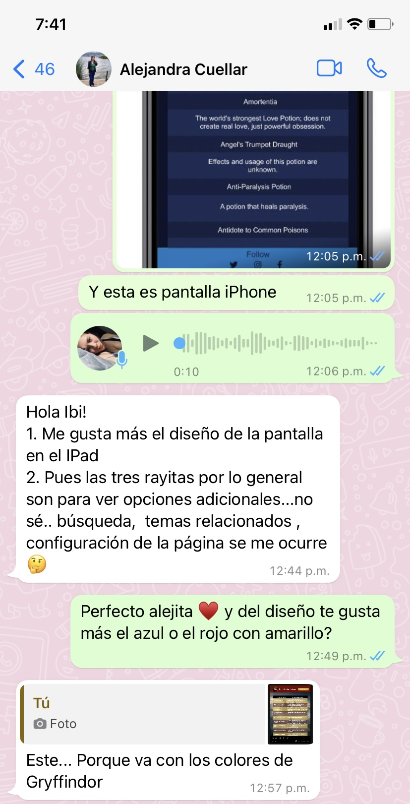

  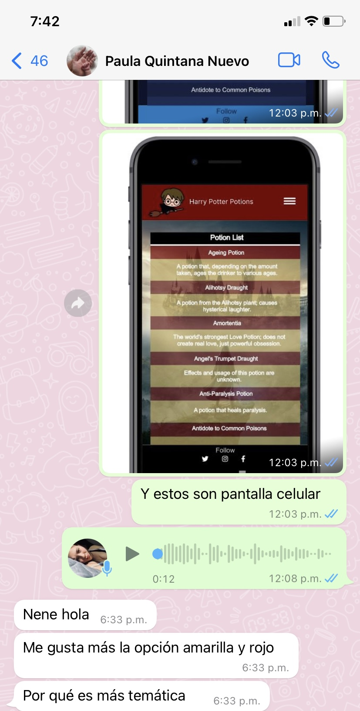

  **_Respuestas adicionales:_**
  * Usuario 4: Selecciona la azul
  * Usuario 5: Selecciona la opcion con los colores tematicos

**Dadas estas respuestas, se procede a escoger el estilo tematico.**

## 3. Historias de usuario

Dadas las preferencias del usuario se planearon las historias de usuario, distribuidas asi:

###**1. Primera historia de usuario**

**Como**: Como usuaria
**Quiero**: Quiero visualizar la lista de pociones del mundo de Harry Potter
**Para**: Para conocerlas y entenderlas

**Criterios de aceptacion**:
  * Que tenga el header con logo, con un boton de visualizar (completo).
  * Que tenga lista de pociones: nombre y su descripcion.
  * que tenga el footer: iconos, fan page y redes sociales.
  *  Fondo tematico de Harry Potter en el main-paleta de colores.

**Prototipo baja fidelidad Historia de usuario No. 1**:

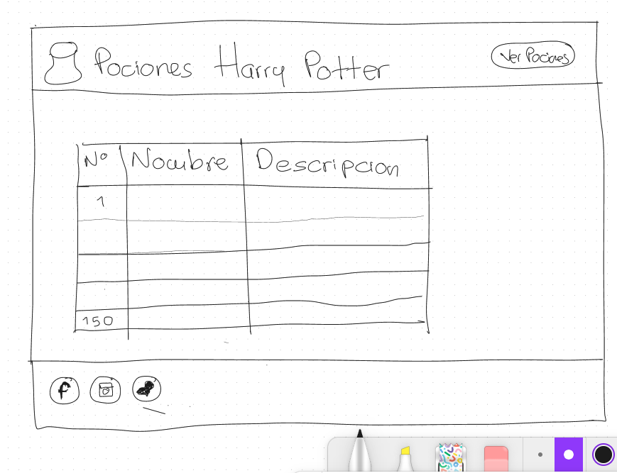

**Prototipo alta fidelidad Historia de usuario No. 1**:

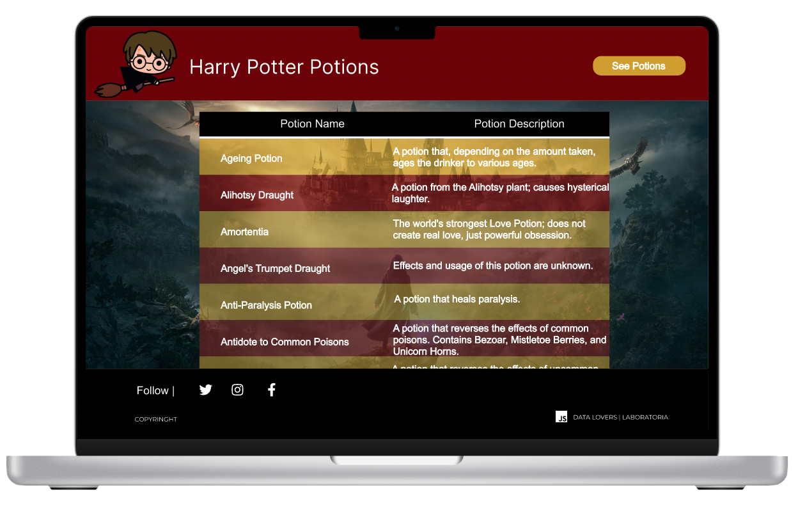

 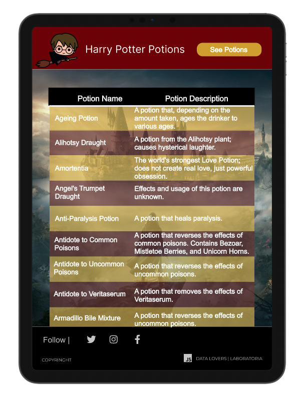
 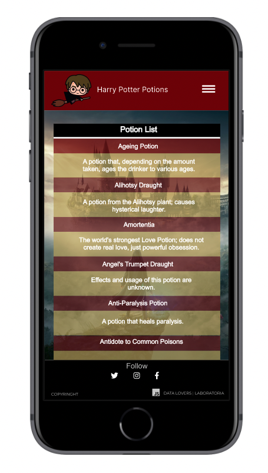

###**2. Segunda historia de usuario**

**Como**: Como usuaria
**Quiero**: Quiero filtrar la información por nombre o por descripción o poder ordenar la lista de la A-Z y de la Z-A
**Para**: Para visualizar la que quiero o necesito de una manera mas facil

**Criterios de aceptacion**:
  * Incluir las opciones en el header de filtrado, ordenar, y calcular.
  * Realizar logo clickeable y que redirija a la pagina inicial.
  * Implementar pagina de bienvenida con un parrafo y un boton para ver la lista de pociones
  *  Que la opcion filtrado, filtre por nombre y por descripcion.
  * Mostrar el input de filtrado en la pantalla y que sea funcional.
  * Que al filtrar muestre en la pantalla solo las opciones coincidan con la busqueda.
  * Que la opcion ordenar, ordene los nombres de las pociones de A-Z y de Z-A.
  * Realizar el menu desplegable solo en dispositivos moviles.
  * Que el footer quede estatico.
  * Hacer el test del filter
  * Hacer test de order

**Prototipo baja fidelidad Historia de usuario No. 2**:

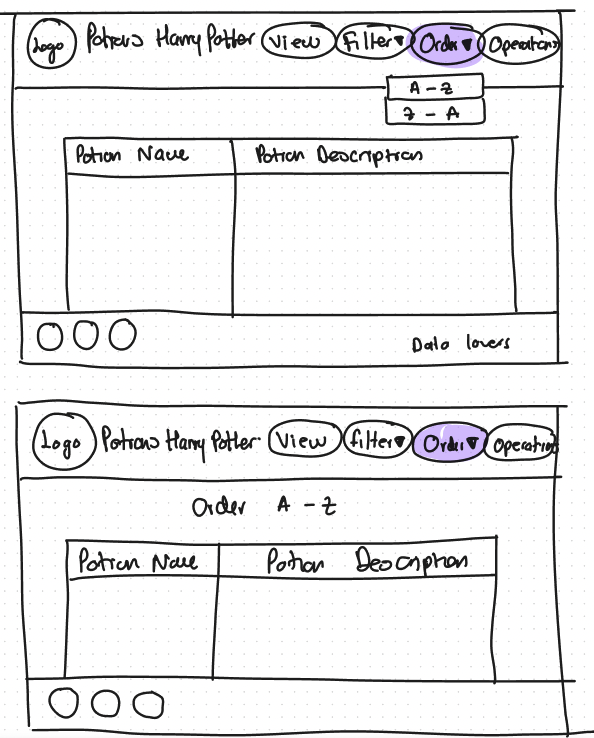
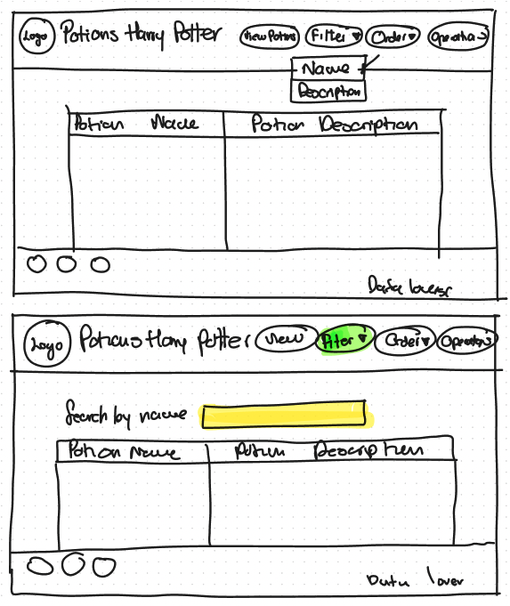

**Prototipo alta fidelidad Historia de usuario No. 2**:

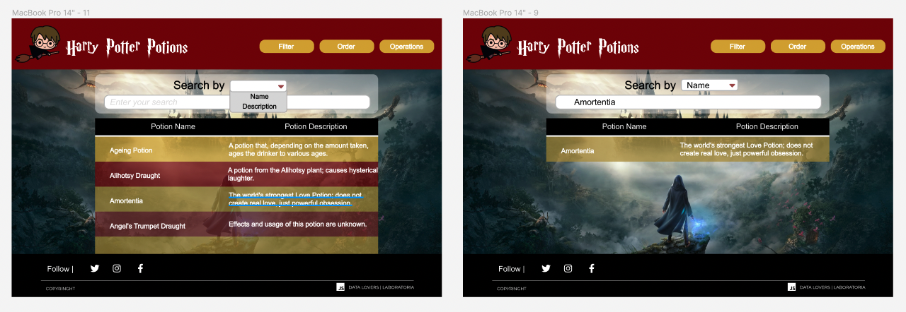

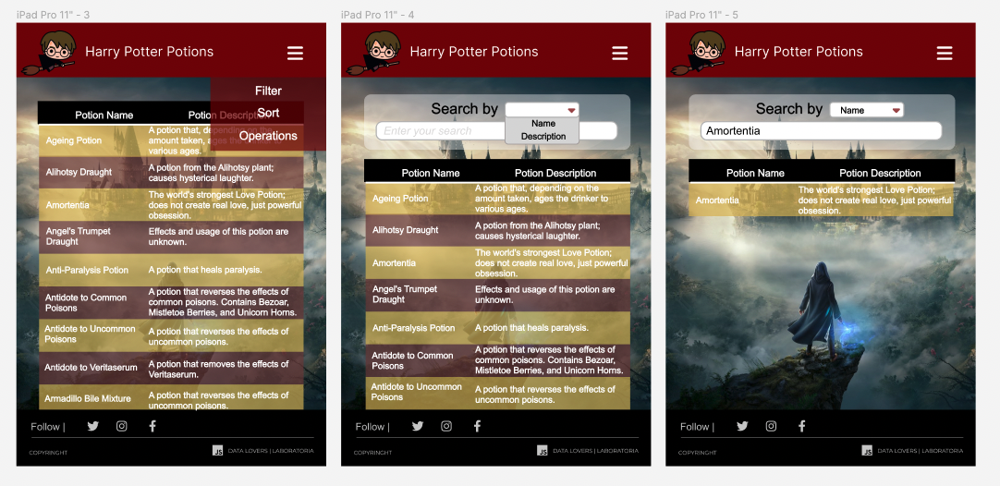

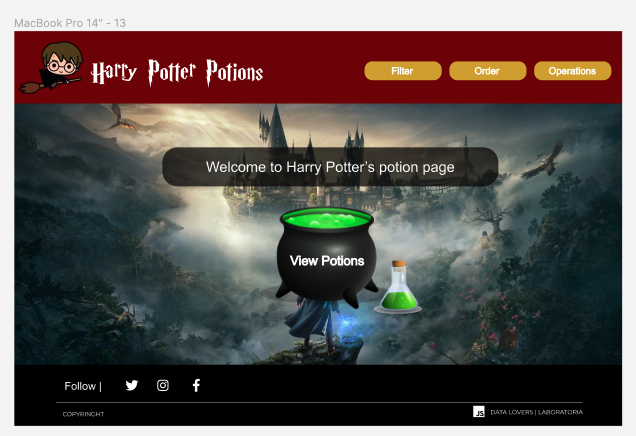

###**3. Tercera historia de usuario**

**Como**: Como usuaria
**Quiero**: Quiero visualizar el porcentaje de coincidencias de mi búsqueda dentro de la descripción de todas las pociones
**Para**: Para conocer que pociones puedo usar y escoger según lo que necesito

**Criterios de aceptacion**:
  * Función de calcular porcentajes de coincidencia.
  * Hacer el test de la función calcular.
  *  Agregar links a los iconos de redes sociales.
  * Limpiar la info por cada una de las secciones.
  * Desplegar en GitHub pages.
  * README del proyecto.

**Prototipo alta fidelidad Historia de usuario No. 3**:

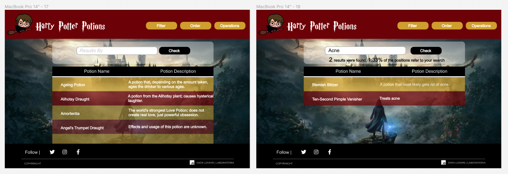

## 4. Autoras

- Adriana Maria Ruiz Henao
- Ibeht Milady Carreño Avella

